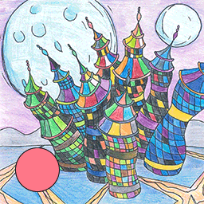

# engiffen

Generates gifs from image sequences.




_Source frame, generated gif, and a gif from Photoshop_

# usage

## as binary

```bash
# Read a bunch of bitmaps and write them to a 20-frame-per-second gif at path `hello.gif`
engiffen *.bmp -f 20 -o hello.gif

# Read a range of files and write them to `out.gif` (the default output path)
engiffen -r file01.jpg file20.jpg
# The app sorts them in lexicographical order, so if your shell orders `file9`
# before `file10`, the resulting gif will not be in that order.
```

## as library

```rust
extern crate engiffen;

use engiffen::{load_images, engiffen, Gif};
use std::fs::File;

let paths = vec!["vector", "of", "file", "paths", "on", "disk"];
let images = load_images(&paths);
let mut output = File::create("output.gif")?;

let gif = engiffen(&images, 10)?; // encode an animated gif at 10 frames per second
gif.write(&mut output);
```

## Major work to do

* Incremental frame processing

  Accept a stream of frames from a server to process individually as they arrive. Put off sorting the final palette and compiling the gif until finished.

## Anything else?


